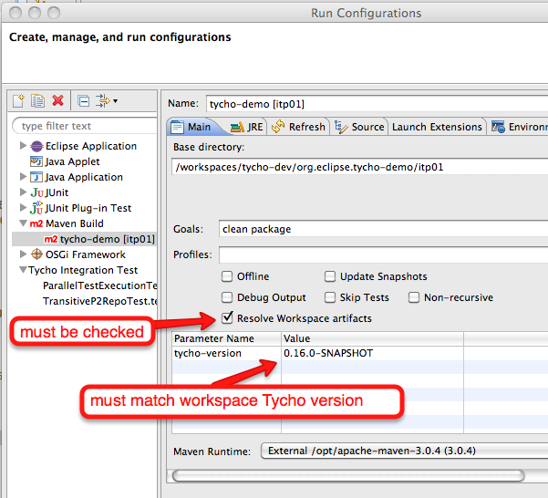

Tycho development support

# m2e and pde workspace dependency resolution for Tycho artifacts.

m2e and pde workspace dependency resolution for Tycho artifacts allows successful invocation of "Run As Maven Build" 
and "Run As Tycho IT" launch configurations directly from Eclipse workspace, without the need to install/deploy
Tycho to a Maven repository first.

Additionally, source code lookup works for all workspace projects and their dependencies. This is supported via
https://github.com/ifedorenko/com.ifedorenko.m2e.sourcelookup.

# Installation and configuration

* Install m2e 1.1 or better from http://www.eclipse.org/m2e/download/
* Install Dynamic Sources Lookup m2e and Tycho Development Support extensions from 
  http://ifedorenko.github.com/m2e-extras/

# Use

* Workspace dependency resolution is disable for Run As Maven Build launch configurations by default.
  Enable it on "Main" launch configuration tab. Make sure the build uses workspace Tycho version
  

* Run As Tycho IT has workspace dependency resolution enabled and does not require any configuration.

# Known limitations

* Running all tests in tycho-its project fails with OOME permgen due to classloader leak in Maven and P2.
  Run/debug specific tests or test suits as a workaround.

* Integration tests when executed with m2e embedded maven runtime (the default unfortunately). Configure
  external default maven installation in m2e workspace preferences as a workaround.

* Changes to maven mojo annotations require full project rebuild (i.e. Project->Clean...) to take affect.

* Some Maven plugins assume all dependency artifacts are resolved into files. Such Maven plugins are
  not compatible with workspace dependency resolution.
